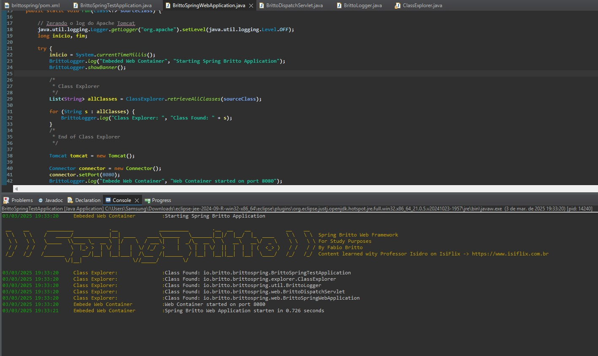

# 🏗️ Spring Britto  

Spring Britto é um framework web criado como um objeto de estudo, inspirado nas aulas do Professor Isidro na plataforma [IsiFlix](https://app.isiflix.com.br/). 
O projeto foi desenvolvido para aprofundar conceitos fundamentais de frameworks web Java, como injeção de dependências, mapeamento de requisições, logging personalizado, manipulação de metadados e o uso de um servlet único para capturar e processar requisições.



## 🚀 Motivação  

A motivação para estudar e desenvolver este projeto foi a de procurar entender **como frameworks web funcionam internamente**.

## 🔥 Funcionalidades  

- 🌍 **Dispatcher Servlet** (BrittoDispatchServlet) - Um grande servlet que gerencia todas as requisições HTTP  
- 📜 **Logger Personalizado** (BrittoLogger) - Simula o log do Spring Boot com cores e níveis de log personalizados  
- 🔍 **Mapeamento de Arquivos via Grafos** - Percorre as pastas do projeto usando **busca em profundidade**  
- 🎯 **Annotations Personalizadas** - Anotações como `@BrittoController`, `@BrittoService` e `@BrittoGetMethod` para estruturar aplicações  
- 📦 **Injeção de Dependências** - Implementação de um sistema de injeção de dependências próprio, semelhante ao `@Autowired` do Spring  
- 🔄 **Manipulação de Requisições GET e POST** - Suporte a JSON via **GSON**  

## 🏗️ Estrutura do Projeto  

```
brittospring/
│── src/main/java
│   ├── io/britto/brittospring/
│   │   ├── annotations/       # Anotações personalizadas do framework
│   │   ├── datastructures/    # Estruturas de dados para controle de dependências, instâncias, Controllers e Inplenentações de Services
│   │   ├── explorer/          # Classe responsável pela busca em profundidade nos diretórios do projeto
│   │   ├── util/              # Implementação de um Logger personalizado
│   │   ├── web/               # Dispatch Servlet e BrittoSpringWebApplication
│── README.md                  # Documentação do projeto
```

## 🏗️ Anotações Criadas  

| Anotação             | Funcionalidade |
|----------------------|---------------|
| `@BrittoController`  | Define uma classe como um Controller |
| `@BrittoService`     | Define uma classe como um Service (bean gerenciado) |
| `@BrittoInjected`    | Realiza injeção de dependência automática |
| `@BrittoGetMethod`   | Define um método como handler de requisições GET |
| `@BrittoPostMethod`  | Define um método como handler de requisições POST |
| `@BrittoBody`        | Indica que um método recebe um JSON no corpo da requisição |

## ⚡ Exemplo de Uso  (Projeto teste que usa Spring Britto como biblioteca)

```java
@BrittoController
public class HelloController {
	
	@BrittoInjected IService service;

	@BrittoGetMethod("/britto")
	public String sayHelloWorld() {
		return "Hello World";
	}
	
	@BrittoGetMethod("/teste")
	public String sayTeste() {
		return "Teste funcionando!";
	}
	
	@BrittoGetMethod("/produto")
	public Produto exibirProduto() {
		Produto p = new Produto();
		p.setNome("Computador");
		p.setPreco(2500.00);
		p.setLinkFoto("computador.jpg");
		return p;
	}
	
	@BrittoPostMethod("/produto")
	public Produto cadastrarProduto(@BrittoBody Produto novoProduto) {
		System.out.println(novoProduto);
		return novoProduto;
		
	}
	
	@BrittoGetMethod("/injected")
	public String sayCustomMessage() {
		return service.sayCustomMessage("Hello World!");
	}
```

## 🔗 Projeto de Teste  

Um projeto de exemplo utilizando o **Spring Britto** pode ser encontrado aqui:  
🔗 [Projeto para teste de uso do Spring Britto Framework](https://github.com/FabioBritto/web-application-springbritto)  
Como Utilizar

Para utilizar o Spring Britto, siga os passos abaixo:

1. Clone os repositórios

Você precisará clonar dois repositórios:

- Spring Britto

- Projeto de Teste

2. Configure o Build Path do projeto de teste

Após clonar os repositórios, é necessário configurar o Build Path do projeto de teste para garantir que o framework seja reconhecido corretamente:

Em sua IDE, abra as configurações do projeto de teste.

Adicione o projeto brittospring na aba Projects dentro do Build Path.

Certifique-se de que todas as dependências estão corretamente configuradas.

Caso tenha alguma dúvida sobre essa configuração, entre em contato.

## 📜 Tecnologias Utilizadas  

- **Java 8**  
- **Servlet API**
- **Reflection API**
- **Tomcat Embutido**  
- **GSON** (para manipulação de JSON)  
- **Estruturas de Dados (Grafos, HashMaps, etc.)**  
 

📬 Me contate caso queira conversar sobre este ou outros projetos:

## 📬 Contato  
📧 **E-mail:** [fabio.tritono@gmail.com](mailto:fabio.tritono@gmail.com)  
🐙 **LinkedIn:** [linkedin.com/in/fabio-britto-399223252](https://www.linkedin.com/in/fabio-britto-399223252/)
